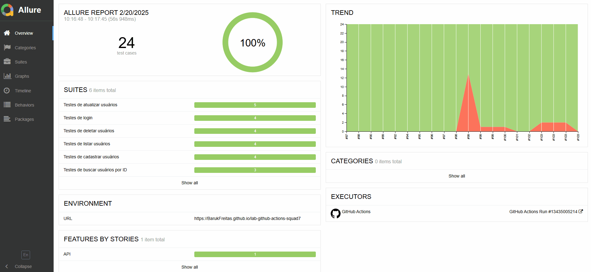

<h1 align="center"> ♻️ Workflow com Github Actions </h1><p align="center">

## Sobre o projeto
Este projeto tem como objetivo garantir a qualidade contínua de um sistema de e-commerce em constante evolução, utilizando uma pipeline de testes automatizados. 
Com o foco em entrega contínua de valor, foram implementadas soluções para testar a API ServeRest, assegurando sua funcionalidade, desempenho e confiabilidade.

## Tarefas
- Crie um repositório no Github para o projeto de testes de API. 
- Configure o ambiente de desenvolvimento local com as ferramentas escolhidas. 
- Criação dos Testes: Crie testes automatizados de API para endpoints relevantes para a API ServeRest. 
- Integração com o Github Actions:  
- Crie um arquivo de workflow no GitHub Actions para definir a pipeline de testes. 
- Configure a pipeline para executar os testes de API. 
- Adicione etapas para executar os testes de Health check, Contrato e Funcional. 
- Relatório de Testes: Configure a pipeline para gerar relatórios de testes com Allure Report e exibir os resultados no Github Pages. 
- Plus: Integre a pipeline com a ferramenta de comunicação Discord para notificar os resultados dos testes. 
- Plus: Integre o SonarQuBe 

## Sumário
- [Sobre o projeto](#sobre-o-projeto)
- [Tarefas](#tarefas)
- [Estrutura dos testes](#estrutura-dos-testes)
- [Ferramentas](#ferramentas)
- [Arquitetura da pipeline](#arquitetura-da-pipeline)
- [Resultados](#resultados)
- [Referências](#referências)

## Estrutura dos testes
Neste projeto, aproveitamos os testes realizados anteriormente na Task final de RestAssured, porém os reorganizamos para se adequarem ao padrão da pipeline, categorizando-os da seguinte forma: 

### Health Check 
Testes responsáveis por verificar a disponibilidade e o funcionamento básico da API, assegurando que ela está operacional e respondendo como esperado. 

### Contrato 
Testes focados em validar a estrutura das respostas da API, garantindo que o formato do JSON está conforme o especificado e que todos os componentes esperados estão presentes. 

### Funcional 
Testes que avaliam as funcionalidades da API, verificando se as respostas retornadas estão corretas e em conformidade com as regras de negócio estabelecidas. 

Além dessas categorias, também adicionamos referências e anotações do Allure Report para organizar melhor o relatório, utilizando: 
- Display Name: Para definir um título claro para os testes e para o switch de testes. 
- Severity: Para classificar a gravidade dos testes, com níveis como “trivial”, “minor”, “normal”, “crítico” e “bloqueador”. 
- Epic, Feature, Story: Para estruturar uma hierarquia baseada em comportamento, seguindo as boas práticas do Allure.

### Exemplo de Teste após Reestruturação: 
```
@Epic("API")
@Feature("FUNCIONALIDADES")
@Story("BUSCAR USUÁRIOS POR ID")
@DisplayName("Testes de buscar usuários por ID")
public class BuscarUsuariosPorIdTest {

    private final UsuarioClient usuarioClient = new UsuarioClient();

    @Test
    @DisplayName("CT003 - Validar buscar usuário por ID")
    @Tag("HealthCheck")
    @Severity(SeverityLevel.NORMAL)
    public void testBuscarUsuarioPorIdComSucesso() {

        UsuarioRequest usuario = UsuarioDataFactory.usuarioValido();

        String idUsuario = usuarioClient.cadastrarUsuarios(usuario)
        .then()
                .statusCode(201)
                .extract().path("_id")
        ;

        usuarioClient.buscarUsuariosPorId(idUsuario)
        .then()
                .statusCode(200);
    }
```
*As referências e anotações foram obtidas na [Documentação do Allure](https://allurereport.org/docs/junit5-reference/). 
  
## Ferramentas

Durante o projeto foram utilizadas as seguintes ferramentas: 

- Allure Report: 
  - Ferramenta utilizada para gerar relatório de todos os testes, indicando se passaram, deram falha, erro ou se foram ignorados por algum motivo.
    Além disso, a ferramenta também traz mais opções de uso que podem ser lidas melhor na [Documentação oficial do Allure](https://allurereport.org/docs/). 

- Github Actions: 
  - Ferramenta utilizada para entrega contínua e integração contínua (CI/CD) que permite automatizar a compilação, teste e implementação da pipeline.
    Mais informações podem ser obtidas na [Documentação do Github Actions](https://docs.github.com/pt/actions).	 

- SonarQube: 
  - Ferramenta web, que pode ser integrada com vários serviços de criação de pipelines e acompanhamento de projeto, que permite verificar o código através do
    uso de IA, para detectar falhas e possíveis melhorias no código, evitando duplicação de métodos, exposição de dados e garantindo a segurança. Leia mais
    na [Documentação oficial do SonarQube](https://docs.sonarsource.com/sonarqube-server/10.8/). 

- RestAssured: 
  - Ferramenta Java utilizada para criar e gerenciar testes de requisições de API Rest que pode utilizar extensões Maven ou Gradle para ajudar na criação
    de códigos limpos e bem estruturados. Leia mais na [Documentação oficial do RestAssured](https://github.com/rest-assured/rest-assured/wiki/Usage_Legacy). 

- Java Development Kit:
  - Como nossos testes precisam ser escritos e executados na linguagem de programação Java, optamos por usar o kit de desenvolvimento java na versão 17,
    pois é a versão mais estável e segura, com compatibilidade a praticamente todas as ferramentas extraoficiais que nos ajudam a escrever o projeto.
    Confira mais na [Documentação oficial do Java](https://www.oracle.com/java/technologies/javase-jdk17-doc-downloads.html). 

- Maven:
  - Ferramenta de gerenciamento e compreensão de projetos de software baseado no conceito de um modelo de objeto de projeto (POM), pode gerenciar a construção,
    o relatório e a documentação de um projeto a partir de uma informação central, leia mais sobre na [Documentação Maven](https://maven.apache.org/). 

- Discord (WebHook):
  - Ferramenta de comunicação muito utilizada atualmente, com a integração com o Github Actions é possível enviar notificações sobre a execução de pipelines
    diretamente em seu servidor. Para implementar essa funcionalidade, foi utilizada a integração disponibilizada pela página [Discord for GitHub Actions](https://github.com/marketplace/actions/actions-for-discord). 

## Arquitetura da pipeline


Nossa pipeline executa um script que irá compilar o código, rodar alguns testes para verificar se a API está operante, caso esse teste seja positivo, prosseguirá 
para os testes de contrato, que verifica se os testes programados estão seguindo o esquema JSON definido previamente na documentação da API, caso esse teste seja positivo, 
prosseguirá novamente para a próxima etapa que irá testar todas as funcionalidades. Nesta etapa, ele irá fazer testes positivos e negativos, portanto, independente se ocorram erros, 
o relatório irá ser gerado para que assim possamos acompanhar o progresso dos testes, mostrando quais passaram, quais falharam, onde falharam. Além de tudo, o link gerado 
com o relatório será hospedado neste link, que é atualizado sempre que a pipeline é executada, garantindo que o relatório seja sempre dos resultados coletados recentemente. 
Este link também é enviado automaticamente para um servidor no discord, dedicado apenas para que possamos ver as atualizações feitas no projeto. 

## Resultados

Após a implementação e execução da pipeline, o relatório é enviado diretamente para o nosso servidor do Discord. Utilizando o Allure Report, é possível acompanhar 
o registro detalhado de todos os testes realizados. Dessa forma, conseguimos monitorar facilmente a aparição de novos erros, bem como verificar se os erros identificados 
anteriormente foram corrigidos



Durante todo o processo, obtivemos um resultado positivo: todos os 24 testes foram aprovados, sem a detecção de nenhum bug durante a fase de testes no ServerRest. 

Depois da implementação do SonarQube, conseguimos notar como ele ajuda a pontuar onde os desenvolvedores que irão consertar a aplicação devem concentrar seus focos,
pois ele mostra exatamente onde que tem códigos duplicados, onde que tem possíveis erros, onde devem existir manutenções, além de mostrar se a qualidade do código está aceitável ou não. 

O SonarQube faz a analise das mudanças em cada branch, como trabalhamos com a versão gratúita, pudemos analizar apenas a branch Main.
Aqui vemos um exemplo de como é mostrado o report de resultados coletados da branch main.


Além de analisar cada branch como um todo, ele também analisa cada pull request separadamente, mostrando quais foram as mudanças feitas nela, da mesma forma que ele analisa a branch,
mas sem sobrecarregar o leitor com informações que possivelmente ja foram alteradas.


## Referências

- [Documentação oficial do Java](https://www.oracle.com/java/technologies/javase-jdk17-doc-downloads.html) 
- [Documentação Maven](https://maven.apache.org/) 
- [Documentação oficial do RestAssured](https://github.com/rest-assured/rest-assured/wiki/Usage_Legacy) 
- [Documentação oficial do Allure](https://allurereport.org/docs/) 
- [Documentação do Github Actions](https://docs.github.com/pt/actions)
- [Discord for GitHub Actions](https://github.com/marketplace/actions/actions-for-discord) 
- [Documentação oficial do SonarQube](https://docs.sonarsource.com/sonarqube-server/10.8/) 
- [Usando Github Actions e Discord](https://dev.to/yelldutz/como-notificar-sua-build-do-github-usando-github-actions-e-discord-2nbj) 
- [Como Usar os Segredos do GitHub Actions](https://kinsta.com/pt/blog/segredos-github-actions/) 

## PDF da documentação
- [Documentação Squad7](https://dbccompany-my.sharepoint.com/:b:/g/personal/larissa_caldeira_dbccompany_com_br/EYGTe8gAo-BOjjt9Du5lp7UBn1mINDmV0ckBJ1JkscGBnA?e=aXhsBt)
  
<h1 align="center"> Integrantes Squad 07</h1>
<table align="center">
  <tr align="center">
    <td align="center"><a href="https://github.com/Larimcal"><br /><sub><b>Larissa Caldeira</b></sub></a></td>
    <td align="center"><a href="https://github.com/BarukFreitas"><br /><sub><b>Yuri Baruk Freitas</b></sub></a></td>
  </tr>
</table>
